# nettowel
Collection of useful network automation functions 

> ⚠️ `nettowel` is under heavy construction and not production ready. Feedback is highly appreciated.


## Install

You can install `nettowel` directly from pypi

```bash
pip install nettowel
```

To reduce the dependencies the extra dependencies are grouped

The following groups are available (more details in the in the pyproject.toml):

- full
- jinja
- ttp
- textfsm
- napalm
- netmiko
- scrapli
- nornir

```bash
pip install nettowel[jinja]
pip install nettowel[full]
```

## Install from source

```
git clone ....
cd nettowel
poetry install
poetry run nettowel --help
```


## Help and shell auto completion

Thanks to the library [typer](https://typer.tiangolo.com/) `nettowel` comes with a nice help and autocompletion install

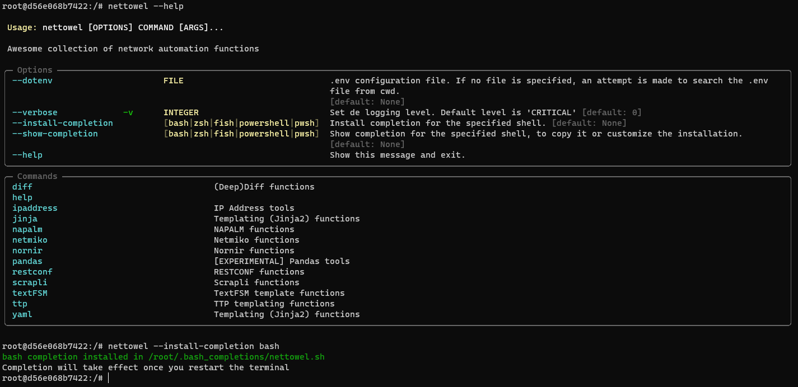


## Features

Many features are not implemented yet and many features will come.


<details>
<summary>Jinja2</summary>

### render

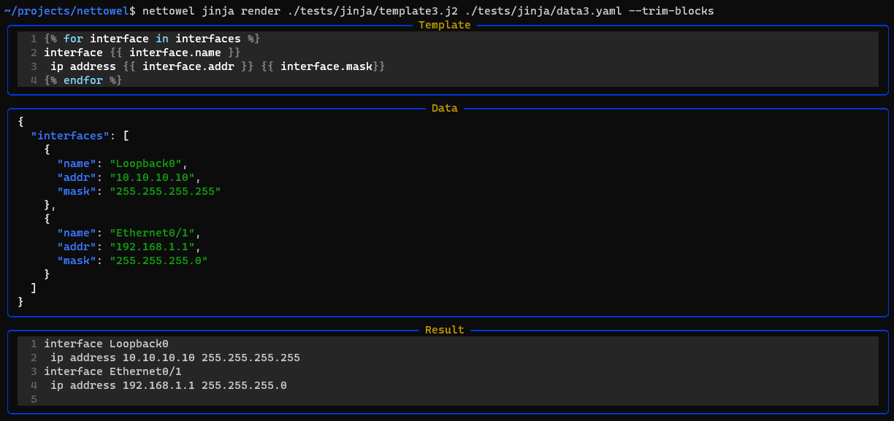

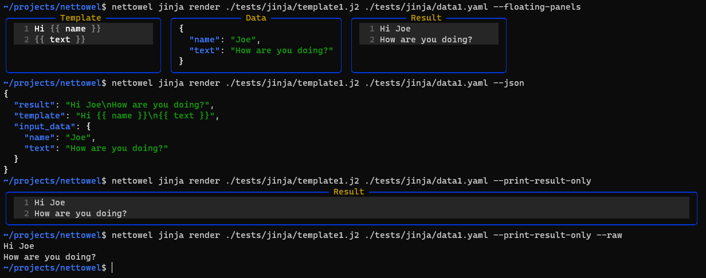

### validate

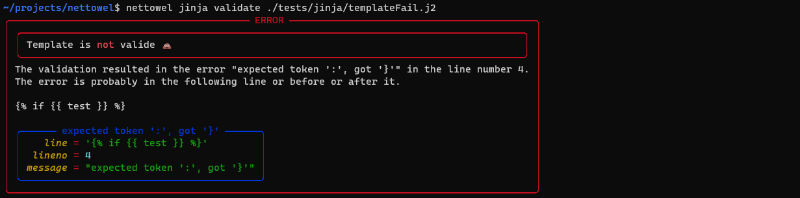

### variables

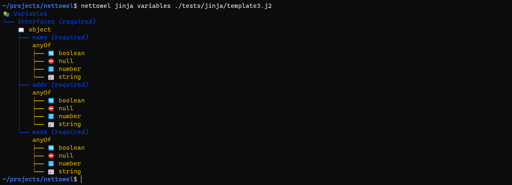

</details>

<details>
<summary>TTP</summary>

### render

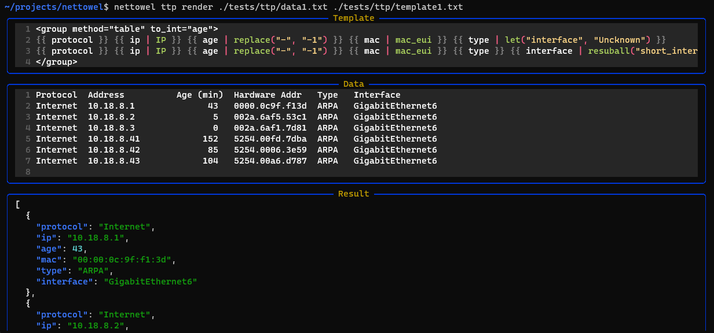

</details>

<details>
<summary>Netmiko</summary>

### cli

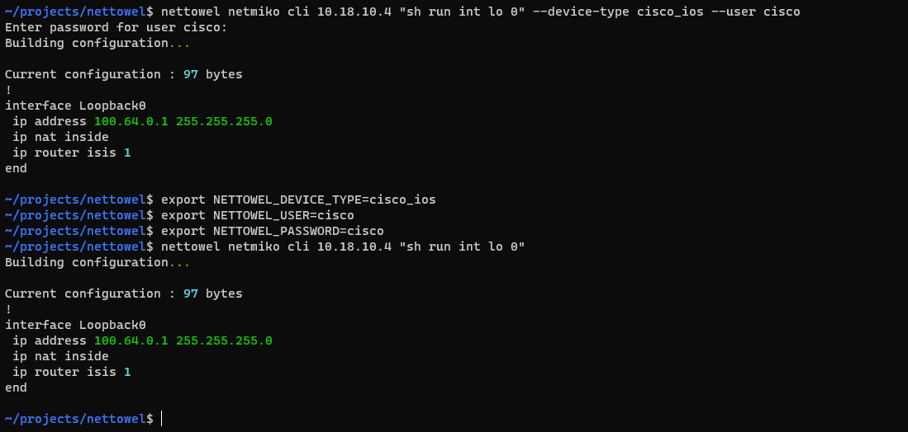

### autodetect

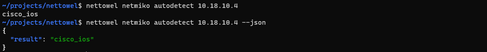

### device-types

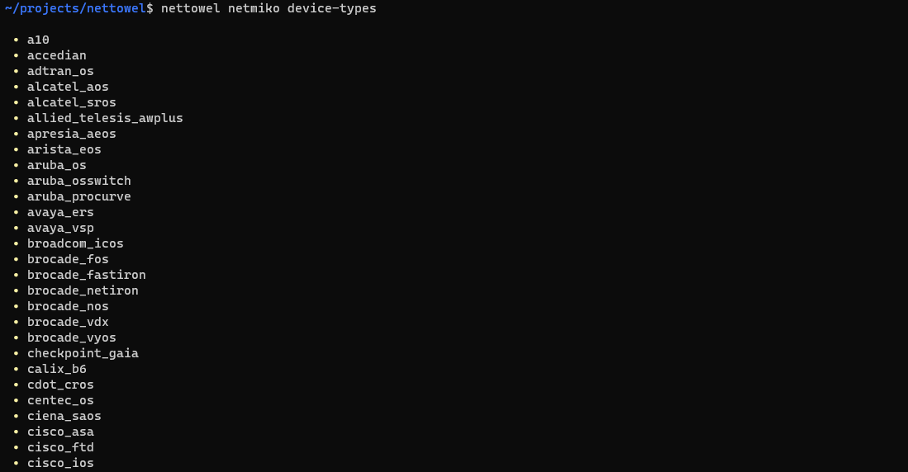

</details>

<details>
<summary>ipaddress</summary>

### ip-info

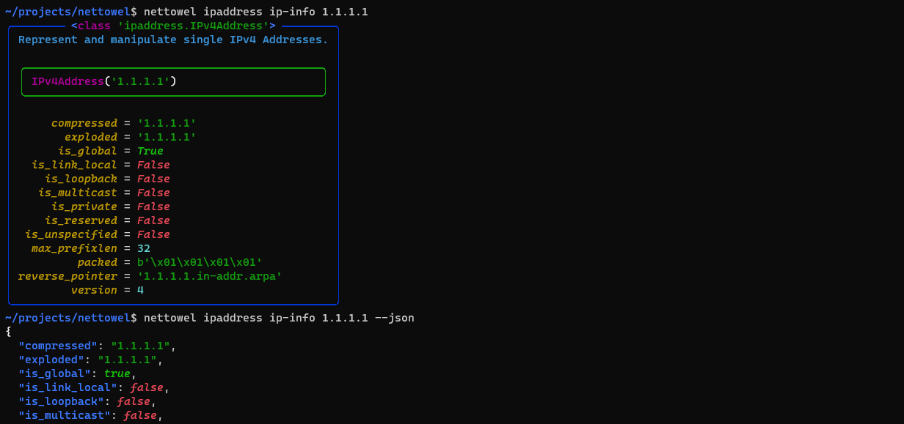

### network-info

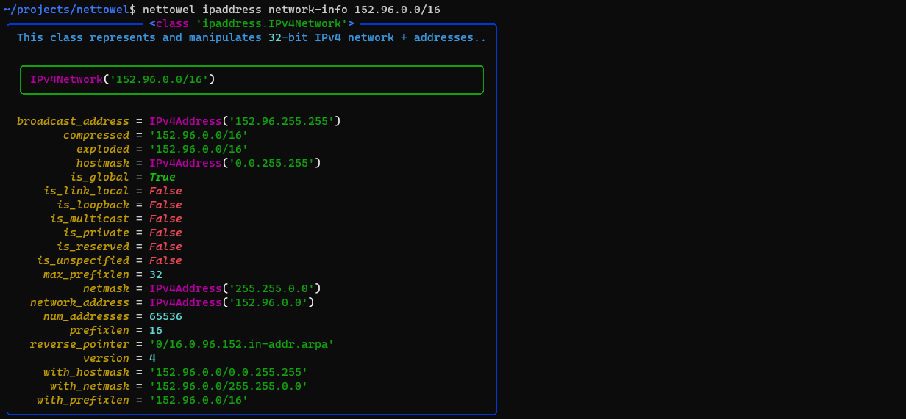

</details>

<details>
<summary>Help</summary>

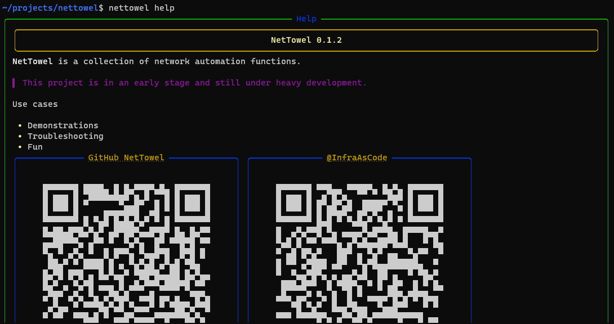

</details>

<details>
<summary>Settings</summary>

A `dotenv` file can be used as a settings file. It also be provided an `dotenv` file with the option `--dotenv`.

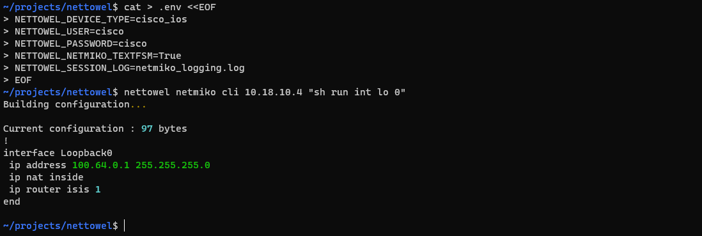

</details>

<details>
<summary>Piping</summary>

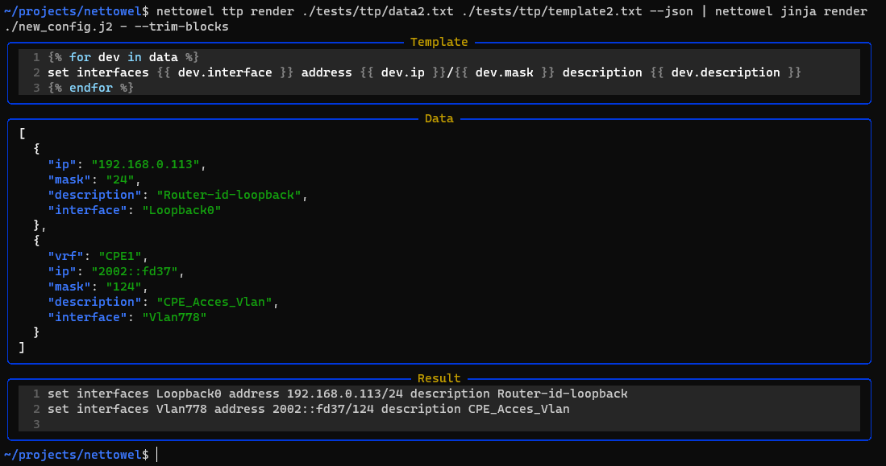

</details>


## Building CLI Docs

**At the moment `typer-cli` is not ready for typer 0.4.0**

```
typer nettowel/cli/main.py utils docs --name nettowel --output CLI.md
```
