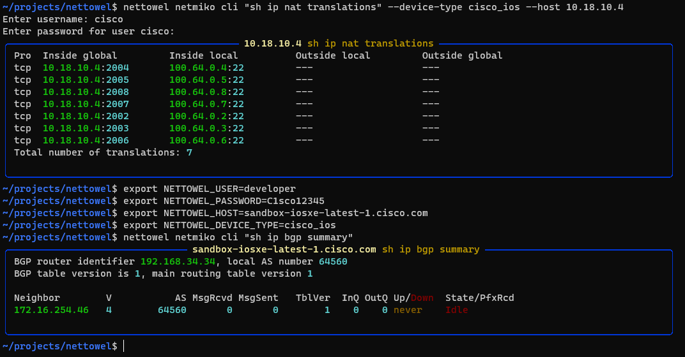
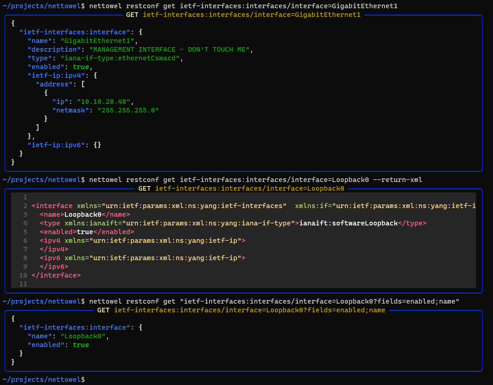
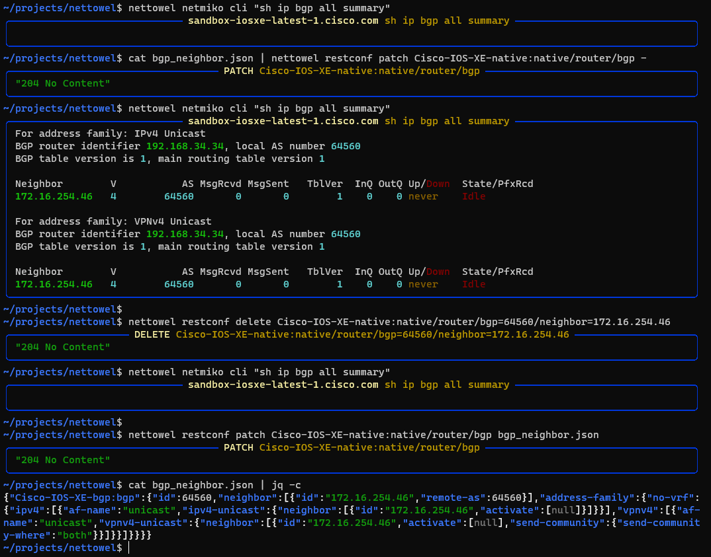
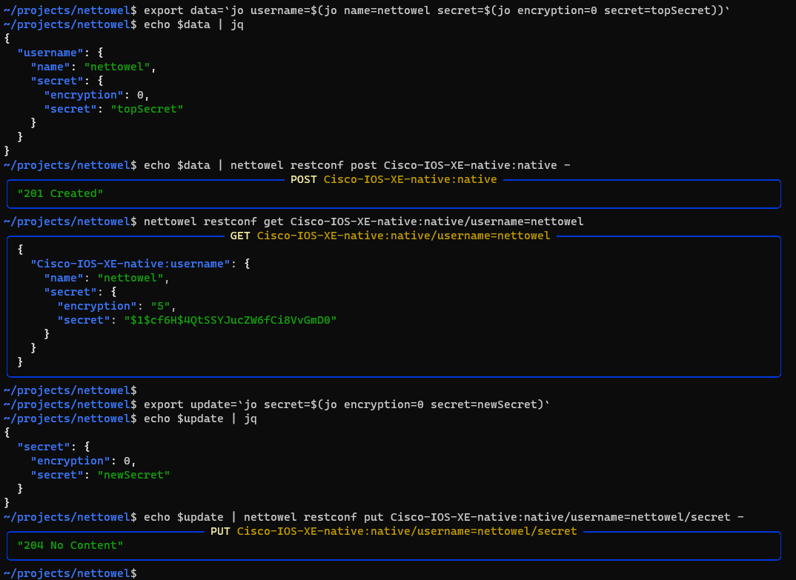

[](https://pypi.python.org/pypi/nettowel/)
[](https://github.com/ambv/black)
[](CODE_OF_CONDUCT.md)

# NetTowel
Collection of useful network automation functions 


> ⚠️ `nettowel` is under heavy construction and not production ready. Feedback is highly appreciated.


## Install

You can install it directly from pypi

```bash
pip install nettowel
```

To reduce the dependencies the extra dependencies are grouped

The following groups are available (more details in the pyproject.toml):

- full
- jinja
- ttp
- textfsm
- napalm
- netmiko
- scrapli
- nornir
- pandas

```bash
pip install nettowel[jinja]
pip install nettowel[full]
```

## Install from source

```
git clone ....
cd nettowel
poetry install
poetry run nettowel --help
```


## Help and shell auto-completion

Thanks to the library [typer](https://typer.tiangolo.com/), `nettowel` comes with a nice help and autocompletion install


## Features

Many features are not implemented yet and many features will come.


### Jinja2

#### render


#### validate


#### variables


### TTP

#### render


### Netmiko

#### cli



#### autodetect


#### device-types


### RESTCONF

#### get



#### patch, delete



#### post, put



### ipaddress

#### ip-info


#### network-info


### Help


### Settings

A `dotenv` file can be used as a settings file. The file can also be provided with the option `--dotenv`.


### Piping


## Building CLI Docs

**At the moment `typer-cli` is not ready for typer 0.4.0**

```
typer nettowel/cli/main.py utils docs --name nettowel --output CLI.md
```

## Contributing

### Run tests:

```bash
make tests
```


### Bump version:

Steps: patch, minor, major, prepatch, preminor, premajor, prerelease.

```bash
make bump ARGS=patch
```